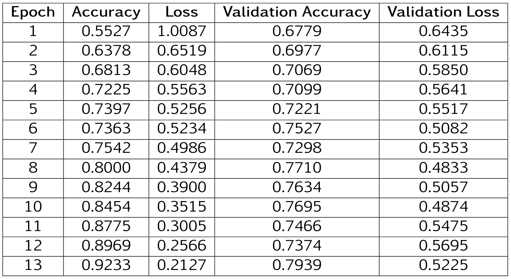

# Image Classifier using Differential Privacy
Conventional machine learning models built using standard pipelines are vulnerable to attacks from adversaries aiming to uncover the underlying training data. It has been demonstrated that adversaries can re-engineer an image classifier to reconstruct images of the CIFAR-10 training set. Machine learning models that are trained on sensitive datasets pose a higher privacy risk. Differential Privacy (DP) is a technique for preserving the privacy of individuals in a dataset while allowing meaningful analysis of the data. The idea of the technique is to add random noise to the data in such a way that no inferences can be made about sensitive data. A dataset of images that can be considered as private was chosen to effectively demonstrate the effect of using Differential Privacy. Therefore, an image dataset of smokers and non-smokers was used. The dataset is publicly available for download at: https://drive.google.com/file/d/19CoKtewBibqszidkH0TMaY0EefQ9eT0d/view?usp=sharing. It contains 1,996 images of smokers and 1,279 for non-smokers. Since gradient clipping is performed during the training process with DP-SGD, the images were also resized to n × n dimensions with the SAME padding type. For a total of 3275 images, 2,620 images were used for training and the remaining 655 for the testing set.

# Privacy Budget
Differential Privacy provides a formal guarantee of privacy that prevents an adversary to gain information about individual training points from a machine learning model. This privacy guarantee is quantified by the parameters ε and δ, collectively known as the "Privacy Budget". ϵ is a positive value and the value of δ falls within the range of 0 to 1. In essence, ϵ sets an upper limit on the log-likelihood ratio of any output that can be obtained when the algorithm is run on two datasets that differ by one data point. δ is a small probability that restricts the occurrence of rare outputs that exceed this limit. By setting appropriate values in the privacy budget, we can regulate the trade-off between privacy preservation and data utility.

# DP-SGD
Differentially Private Stochastic Gradient Descent (DP-SGD) is the most widely adopted approach for training neural networks with differential privacy. Instead of using the standard mini-batch gradient estimate of SGD, DP-SGD employs a modified version that incorporates privacy safeguards. To achieve this, the gradient of each training example is clipped, restricting its maximum norm. Moreover, Gaussian noise is introduced that is proportional to the clipping norm which is added to the sum of the clipped gradients. This noise effectively masks the impact of any individual example on the overall sum. Throughout training, a privacy accountant is utilized to monitor the cumulative privacy cost incurred by each evaluation of a privatized mini-batch gradient. The parameters associated with privacy such as the privacy cost and noise progressively increase with each observed mini-batch during training. They also decrease as the noise scale is adjusted, ensuring a controlled level of variance in the gradient estimate. As a result, this process establishes a limit on the number of training iterations possible within a fixed privacy budget while maintaining manageable levels of gradient estimate variation.

# Methodology
The aim of this project was to evaluate a non-private and a differentially private CNN model. For the latter, privacy reltaed metrics such as ε and δ are also evaluated.

A suitable CNN model was first constructed to make a classifier in a non-private setting. The choice between using a deep or shallow model structure was made by considering the size of the dataset. Since the dataset does not consist of a very large number of images, a shallow model structure with one hidden layer was preferred. The model is effective in learning features from the dataset using a reasonable amount of computational resources. Once the non-private CNN model is trained, a new model is created with the same structure. This model is then trained with Differential Privacy using the "tensorflowprivacy" library. The structure of the CNN in both cases is as follows:

In order to keep the models for private and non-private training as similar as possible, the same batch size of 131 samples is used in both cases. This specific number was chosen because it the highest common factor of the number of training and testing images. When training a model with differential privacy, this ensures proper noise calibration and facilitates stable model optimization.

# Finding the optimal ε value
The Noise Multiplier directly influences the relationship between the noise added to the gradients and the privacy level represented by the epsilon (ε) value. A smaller ε value corresponds to stronger privacy protection. Choosing an appropriate noise multiplier is essential for achieving a good privacy level. Keeping all other hyper-parameters the same, the noise multiplier was adjusted to find an epsilon (ε) value in the desired range of (0,1) together with an Optimal RDP Order value of less than 20. In the official tensorflow privacy documentation, a value of 18 provides a good trade-off with utility.

ε falls below 1 when the noise multiplier is 3 and the Optimal RDP order stays less than 20 until the noise multiplier is increased to 4.5. Therefore, the CNN model trained with differential privacy is evaluated for noise multiplier values of 3, 3.5 and 4.

# Results
##  Non-Private CNN Model
The non-private CNN model is trained first with 13 Epochs. The training results are summarized as follows:

